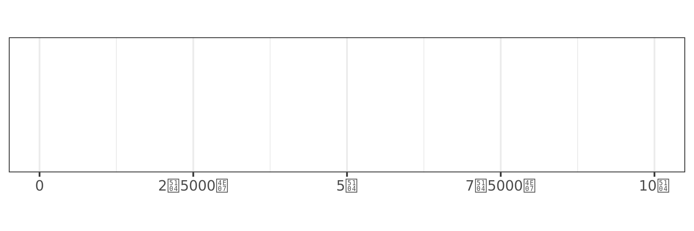

<!-- README.md is generated from README.Rmd. Please edit that file -->

# zipangu 

<!-- badges: start -->

[](https://lifecycle.r-lib.org/articles/stages.html)
[](https://cran.r-project.org/package=zipangu)
[](https://cran.r-project.org/package=zipangu)
[](https://cran.r-project.org/)

[](https://travis-ci.org/uribo/zipangu)
[](https://github.com/uribo/zipangu)
[](https://app.codecov.io/gh/uribo/zipangu?branch=master)
[](https://github.com/uribo/zipangu/actions)
<!-- badges: end -->

The goal of `{zipangu}` is to replace the functionality provided by the
`{Nippon}` archived from CRAN. Add some functions to make it easier to
treat data that address, year, Kanji and Kana.

## Installation

You can install the released version of `{zipangu}` from CRAN with:

``` r
install.packages("zipangu")
```

and also, the developmment version from GitHub

``` r
install.packages("remotes")
remotes::install_github("uribo/zipangu")
```

## API

``` r
library(zipangu)
```

### Address

``` r
separate_address("東京都千代田区大手町一丁目")
#> $prefecture
#> [1] "東京都"
#> 
#> $city
#> [1] "千代田区"
#> 
#> $street
#> [1] "大手町一丁目"
```

Applied to data frame.

``` r
library(dplyr, warn.conflicts = FALSE)
data.frame(address = c("東京都千代田区大手町一丁目", "岡山県岡山市北区清心町16-13")) %>% 
  mutate(address_components = purrr::pmap(., ~ separate_address(..1))) %>% 
  tidyr::unnest_wider(col = address_components)
#> # A tibble: 2 × 4
#>   address                     prefecture city       street      
#>   <chr>                       <chr>      <chr>      <chr>       
#> 1 東京都千代田区大手町一丁目  東京都     千代田区   大手町一丁目
#> 2 岡山県岡山市北区清心町16-13 岡山県     岡山市北区 清心町16-13
```

### Zip-code

``` r
read_zipcode(system.file("zipcode_dummy/13TOKYO_oogaki.CSV", package = "zipangu"), "oogaki")
#> # A tibble: 1 × 15
#>   jis_code old_zip_code zip_code prefecture_kana city_kana street_kana
#>   <chr>    <chr>        <chr>    <chr>           <chr>     <chr>      
#> 1 13101    100          1000001  トウキヨウト    チヨダク  チヨダ     
#> # … with 9 more variables: prefecture <chr>, city <chr>, street <chr>,
#> #   is_street_duplicate <dbl>, is_banchi <dbl>, is_cyoumoku <dbl>,
#> #   is_zipcode_duplicate <dbl>, status <dbl>, modify_type <dbl>
```

You can also load a file directly by specifying a URL.

``` r
read_zipcode("https://www.post.japanpost.jp/zipcode/dl/jigyosyo/zip/jigyosyo.zip")
```

Utilities

``` r
is_zipcode(7000027)
#> [1] TRUE
is_zipcode("700-0027")
#> [1] TRUE
zipcode_spacer("305-0053")
#> [1] "305-0053"
zipcode_spacer("305-0053", remove = TRUE)
#> [1] "3050053"

is_prefecture("東京都")
#> [1] TRUE
```

### Calendar

#### Year (Japanese imperial year)

``` r
convert_jyear("R1")
#> [1] 2019
```

### Date

``` r
convert_jdate("平成元年11月25日")
#> [1] "1989-11-25"
```

#### Public holidays in Japan

Given a year and holiday name as input, returns the date.

``` r
jholiday_spec(2021, "New Year's Day", lang = "en")
#> [1] "2021-01-01"
```

Holiday names can be specified in English (“en”) and Japanese (“jp”) by
default, en is used.

``` r
jholiday_spec(2021, "Coming of Age Day", lang = "en")
#> [1] "2021-01-11"
jholiday_spec(2021, "\u6210\u4eba\u306e\u65e5", lang = "jp")
#> [1] "2021-01-11"
```

Check the list of holidays for a year with the `jholiday()`.

``` r
jholiday(2021, lang = "jp")
#> $元日
#> [1] "2021-01-01"
#> 
#> $成人の日
#> [1] "2021-01-11"
#> 
#> $建国記念の日
#> [1] "2021-02-11"
#> 
#> $天皇誕生日
#> [1] "2021-02-23"
#> 
#> $春分の日
#> [1] "2021-03-20"
#> 
#> $昭和の日
#> [1] "2021-04-29"
#> 
#> $憲法記念日
#> [1] "2021-05-03"
#> 
#> $みどりの日
#> [1] "2021-05-04"
#> 
#> $こどもの日
#> [1] "2021-05-05"
#> 
#> $海の日
#> [1] "2021-07-22"
#> 
#> $スポーツの日
#> [1] "2021-07-23"
#> 
#> $山の日
#> [1] "2021-08-08"
#> 
#> $敬老の日
#> [1] "2021-09-20"
#> 
#> $秋分の日
#> [1] "2021-09-23"
#> 
#> $文化の日
#> [1] "2021-11-03"
#> 
#> $勤労感謝の日
#> [1] "2021-11-23"
```

Use `is_jholiday()` function to evaluate whether today is a holiday.

``` r
is_jholiday("2021-01-10")
#> [1] FALSE
is_jholiday("2021-02-23")
#> [1] TRUE
```

### Convert

#### Hiragana to Katakana and more…

``` r
str_jconv("アイウエオ", 
          str_conv_hirakana, to = "hiragana")
#> [1] "あいうえお"
str_conv_zenhan("ｶﾞｯ", "zenkaku")
#> [1] "ガッ"
str_conv_romanhira("aiueo", "hiragana")
#> [1] "あいうえお"
```

#### Kansuji

``` r
kansuji2arabic(c("一", "百"))
#> [1] "1"   "100"
kansuji2arabic_all("北海道札幌市中央区北一条西二丁目")
#> [1] "北海道札幌市中央区北1条西2丁目"
```

#### Prefecture name

``` r
harmonize_prefecture_name(
  c("東京都", "北海道", "沖縄県"), 
  to = "short")
#> [1] "東京"   "北海道" "沖縄"
harmonize_prefecture_name(
  c("東京", "北海道", "沖縄"), 
  to = "long")
#> [1] "東京都" "北海道" "沖縄県"
```

### Label

``` r
library(scales)
library(ggplot2)
theme_set(theme_bw(base_family = "IPAexGothic"))
demo_continuous(c(1, 1e9), label = label_kansuji())
```



``` r
demo_continuous(c(1, 1e9), label = label_kansuji_suffix())
```


### Data set

``` r
jpnprefs
#> # A tibble: 47 × 5
#>    jis_code prefecture_kanji prefecture    region   major_island
#>    <chr>    <chr>            <chr>         <chr>    <chr>       
#>  1 01       北海道           Hokkaido      Hokkaido Hokkaido    
#>  2 02       青森県           Aomori-ken    Tohoku   Honshu      
#>  3 03       岩手県           Iwate-ken     Tohoku   Honshu      
#>  4 04       宮城県           Miyagi-ken    Tohoku   Honshu      
#>  5 05       秋田県           Akita-ken     Tohoku   Honshu      
#>  6 06       山形県           Yamagata-ken  Tohoku   Honshu      
#>  7 07       福島県           Fukushima-ken Tohoku   Honshu      
#>  8 08       茨城県           Ibaraki-ken   Kanto    Honshu      
#>  9 09       栃木県           Tochigi-ken   Kanto    Honshu      
#> 10 10       群馬県           Gunma-ken     Kanto    Honshu      
#> # … with 37 more rows
```

### Kana (hiragana and katakana)

``` r
kana(type = "hira")
#>  [1] "あ" "い" "う" "え" "お" "か" "き" "く" "け" "こ" "さ" "し" "す" "せ" "そ"
#> [16] "た" "ち" "つ" "て" "と" "な" "に" "ぬ" "ね" "の" "は" "ひ" "ふ" "へ" "ほ"
#> [31] "ま" "み" "む" "め" "も" "や" "ゆ" "よ" "ら" "り" "る" "れ" "ろ" "わ" "を"
#> [46] "ん"

kana(type = "hira", core = FALSE, historical = TRUE)
#> [1] "ゐ" "ゑ"

kana(type = "kata", dakuon = TRUE, handakuon = TRUE, kogaki = TRUE)
#>  [1] "ァ" "ア" "ィ" "イ" "ゥ" "ウ" "ェ" "エ" "ォ" "オ" "カ" "ガ" "キ" "ギ" "ク"
#> [16] "グ" "ケ" "ゲ" "コ" "ゴ" "サ" "ザ" "シ" "ジ" "ス" "ズ" "セ" "ゼ" "ソ" "ゾ"
#> [31] "タ" "ダ" "チ" "ヂ" "ッ" "ツ" "ヅ" "テ" "デ" "ト" "ド" "ナ" "ニ" "ヌ" "ネ"
#> [46] "ノ" "ハ" "バ" "パ" "ヒ" "ビ" "ピ" "フ" "ブ" "プ" "ヘ" "ベ" "ペ" "ホ" "ボ"
#> [61] "ポ" "マ" "ミ" "ム" "メ" "モ" "ャ" "ヤ" "ュ" "ユ" "ョ" "ヨ" "ラ" "リ" "ル"
#> [76] "レ" "ロ" "ヮ" "ワ" "ヲ" "ン" "ヴ"
```
